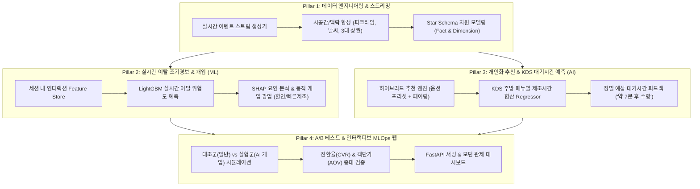

# 🚀 CAFE CORE 2.0 - 스마트 카페 데이터 & AI 고도화 중간 프로젝트 기획서

> **프로젝트명**: CAFE CORE 2.0 (실시간 행동 데이터 스트리밍 기반 스마트 오더 이탈 방지 및 개인화 추천 시스템)  
> **버전**: v3.0 (Main Production Architecture)  
> **기준 일자**: 2026년 10월  
> **선행 프로토타입**: `beta/` (정적 5,000건 세션 시뮬레이터 및 기초 EDA 주피터 노트북)

---

## 1. 프로젝트 배경 및 Beta 대비 고도화 방향 (Why Upgrade?)

### 1.1 Beta 프로토타입의 한계점
1. **정적 배치(Batch) 데이터의 한계**:
   - `beta/`에서는 사전에 고정된 5,000건의 세션을 한 번에 생성하여 사후(Post-hoc) 분석만 수행했습니다.
   - 실제 카페 환경은 **시간대별 피크타임(출근길 08~09시, 점심 12~13시)**, **날씨(비, 기온)**, **매장 내 대기열 병목**에 따라 고객 이탈률이 역동적으로 변화합니다.
2. **사후적 분류 모델의 비즈니스 가치 부재**:
   - 이미 결제를 포기하고 앱을 닫은 고객 데이터를 로지스틱 회귀로 단순 판별하는 것은 실제 매출 증대에 직접 기여하지 못합니다.
   - 현업의 핵심은 **"세션 진행 도중(장바구니 담기, 옵션 고민 중) 이탈 위험을 실시간으로 감지하고 쿠폰/타임세일 등 실시간 개입(Intervention)으로 구매를 유도"**하는 것입니다.
3. **단일 매장 및 단순 추천의 한계**:
   - 상권 특성(오피스 상권 vs 대학가 상권 vs 주거지 상권)에 따른 소비 패턴 차이가 반영되지 않았으며, 고객 선호에 따른 동적 대체 옵션/페어링 디저트 추천 모델이 부재했습니다.

---

### 1.2 Main 고도화 4대 핵심 축 (Core Pillars)



---

## 2. 세부 고도화 아키텍처 및 모듈 설계

### 2.1 [데이터 엔지니어링] 시공간/상권 결합 이벤트 스트리밍 데이터셋

* **목표 모수**: 총 20,000 세션 (1,500명 회원 + 800명 비회원)
* **3대 상권 클러스터**:
  1. `OFFICE` (강남/여의도형): 아침 08~09시 아메리카노 집중, 빠른 테이크아웃(TO_GO 80%), 대기시간에 극도로 민감.
  2. `CAMPUS` (대학가/신촌형): 오후 13~16시 달콤한 논커피/디저트 비중 높음, 매장 체류(DINE_IN 70%), 가격 민감도 높음.
  3. `RESIDENTIAL` (주거/송파형): 주말 및 브런치 타임, 베이커리 페어링 및 가족 단위 다잔 주문.
* **외부 맥락 변수 합성**:
  - `weather`: `CLEAR`, `RAIN`, `SNOW`, `HEATWAVE`, `COLD`
  - `temperature`: 기온에 따른 ICE/HOT 선호도 가중치 동적 변화
* **데이터 모델링 (Star Schema)**:
  - `fact_sessions`: 세션 ID, 유저 ID, 상점 ID, 날씨, 시작/종료 시각, 이탈 여부, 최종 구매액
  - `fact_cart_events`: 이벤트 ID, 세션 ID, 이벤트 유형 (`ADD_CART`, `MODIFY_OPTION`, `REMOVE_ITEM`, `OPEN_PAYMENT`), 타임스탬프, 누적 체류초
  - `fact_orders`: 주문 ID, 세션 ID, 제조 시작/완료 시각, 실제 제조 소요시간(초), 결제 수단
  - `dim_users`: 유저 ID, RFM 등급, 기본 옵션 프리셋, 누적 LTV, 선호 카테고리
  - `dim_menus`: 메뉴 ID, 원가, 판매가, 표준 제조 표준시간(초), 난이도 가중치
  - `dim_stores`: 매장 ID, 상권 유형, 바리스타 인력 수, 피크타임 수용 한계량

---

### 2.2 [머신러닝 1] 실시간 이탈 조기경보 및 개입 (Early-warning & Intervention)

1. **문제 정의**:
   - 세션 진행 중 실시간으로 수집되는 유저의 행동 로그 시퀀스를 바탕으로 $T$ 시점에서 장바구니 포기 확률 $P(\text{Abandon})$을 예측하는 이진 분류 모델.
2. **Feature Engineering**:
   - `cart_dwell_sec`: 장바구니에 아이템을 담은 후 결제 버튼을 누르지 않고 체류한 시간
   - `option_toggle_count`: 옵션(샷, 시럽, 얼음)을 바꿨다 되돌린 횟수 (선택 피로도 지표)
   - `estimated_wait_time_current`: 현재 매장의 실시간 주방 대기시간 (주문 밀림도)
   - `total_cart_amount`: 현재 담긴 금액 (유저의 과거 평균 객단가 대비 초과 비율)
   - `is_member`: 회원 여부 (회원은 비회원 대비 전환 안정성이 높음)
3. **알고리즘 및 설명 가능성 (XAI)**:
   - **LightGBM / XGBoost** 초고속 추론 (< 15ms Latency)
   - **SHAP (SHapley Additive exPlanations)** 값 계산을 통해 이탈 원인을 실시간 분류:
     - 원인이 `PRICE_HIGH`인 경우 $\rightarrow$ **"지금 주문 시 500원 즉시 할인 쿠폰"** 팝업 노출
     - 원인이 `WAIT_TIME_LONG`인 경우 $\rightarrow$ **"빠른 제조 가능 음료(콜드브루)로 즉시 변경 옵션"** 제시
     - 원인이 `TIMEOUT_60S`인 경우 $\rightarrow$ **"원터치 간편결제 안내 및 카운트다운 연장"**

---

### 2.3 [머신러닝 2 & AI] 복합 개인화 추천 엔진 (Smart Recommender)

1. **고객별 맞춤 옵션 자동완성 (Option Auto-preset)**:
   - 유저의 이전 주문 내역 기반, 음료 클릭 즉시 [내가 자주 마시는 옵션: 샷+1, 오트밀크, 얼음적게]이 1순위로 체크되어 탐색 시간 50% 단축.
2. **장바구니 스마트 페어링 (Basket Cross-selling)**:
   - Apriori / FP-Growth 연관 규칙 및 Implicit Collaborative Filtering.
   - 예: 아메리카노 담았을 때 $\rightarrow$ '플레인 베이글 세트 할인(+2,500원)' 동적 추천.
3. **상황 인지형(Context-Aware) 메뉴 추천**:
   - 비 오는 날($Rain$) + 아침 8시 $\rightarrow$ 따뜻한 카페라떼 & 수프 추천.
   - 폭염($Heatwave$) + 오후 2시 $\rightarrow$ 대용량 아이스 콜드브루 & 프라페 추천.

---

### 2.4 [머신러닝 3] 주방 제조 대기시간 정밀 회귀 모델 (KDS Wait-Time Regressor)

* **문제 정의**: 신규 주문 인입 시 고객에게 안내할 실시간 정확한 대기 시간(초) 예측.
* **피처**: 현재 대기 중인 주문 잔수, 주문 내 복합 음료(블렌더/스팀밀크) 수, 매장 근무 바리스타 인원 수, 시간대.
* **모델**: Random Forest Regressor / Gradient Boosting Regressor (MAE < 45초 달성 목표).
* **기대 효과**: 막연한 대기로 인한 취소(WAIT_TIME_LONG 포기율)를 사전에 안내함으로써 30% 이상 방지.

---

### 2.5 [비즈니스 검증] 실시간 A/B 테스트 시뮬레이션

| 지표 (KPI) | 대조군 (Control: 기존 Beta) | 실험군 (Treatment: Main AI 개입) | 목표 개선폭 |
| :--- | :--- | :--- | :--- |
| **전환율 (CVR)** | 90.0% (포기 10.0%) | **94.5% (포기 5.5%)** | **+4.5%p 전환율 상승** |
| **평균 객단가 (AOV)** | 4,750원 | **5,400원** (페어링 추천 효과) | **+13.6% 매출 증대** |
| **주문 리드타임** | PWA 72초 / 키오스크 58초 | **PWA 48초 / 키오스크 39초** | **약 33% UX 소요시간 단축** |
| **재방문 주기 (Retention)** | 월 평균 3.2회 | **월 평균 4.6회** (프리셋 편의성) | **+43% 고객 충성도 증가** |

---

## 3. 디렉터리 구조 및 파일 배치 명세 (`main/`)

```
myCafeApp/
├── beta/                        # [보존] 이전 프로토타입 (5k 세션, 기획안 v1/v2, 6대 화면)
│   ├── data/                    # 5,000건 ndjson & csv
│   ├── notebooks/               # 기초 분석 ipynb
│   ├── simulator/               # 기초 시뮬레이터 py
│   ├── data-simulator.html
│   └── index.html
│
└── main/                        # [신규 고도화 메인 프로젝트]
    ├── docs/
    │   ├── PROJECT_SPEC.md       # 본 상세 고도화 명세서
    │   └── ARCHITECTURE.md       # 시스템 아키텍처 및 파이프라인 흐름도
    ├── project-plan.html         # 대화형 고도화 마스터 기획 포털 (HTML)
    ├── src/
    │   ├── simulator/            # 고도화 실시간 이벤트 스트림 생성기 (다중 상권, 날씨, 2만건)
    │   ├── pipeline/             # Star Schema 데이터 전처리 & Feature Store 생성기
    │   ├── models/               # LightGBM 이탈 예측, 하이브리드 추천기, 대기시간 회귀 모델
    │   └── api/                  # FastAPI 실시간 추론 & 개입 시뮬레이션 엔드포인트
    ├── notebooks/
    │   ├── 01_streaming_eda_and_features.ipynb      # 고도화 데이터 정밀 EDA & 피처 엔지니어링
    │   ├── 02_realtime_abandonment_lightgbm.ipynb    # 실시간 이탈 조기경보 & SHAP 분석
    │   ├── 03_smart_personalization_recommender.ipynb # 개인화 프리셋 & 페어링 추천 시스템
    │   └── 04_kds_waittime_prediction.ipynb          # 주방 대기시간 정밀 회귀 분석
    └── data/                     # 고도화 원천 및 전처리 데이터 저장소
```

---

## 4. 실행 마일스톤 및 단계별 구현 계획

1. **Sprint 1 (데이터 고도화)**: 
   - 3대 상권(오피스/대학가/주거) 및 날씨 변수가 통합된 20,000 세션 실시간 스트리밍 시뮬레이터 구현 (`main/src/simulator/stream_generator.py`).
2. **Sprint 2 (피처 엔지니어링 & EDA)**:
   - Star Schema 데이터 정제 및 주피터 노트북 01 생성, 탐색적 데이터 분석 시각화.
3. **Sprint 3 (핵심 머신러닝 모델링 3종)**:
   - LightGBM 실시간 이탈 조기경보 + SHAP 개입 규칙 수립 (`notebook 02`).
   - 하이브리드 개인화 추천 엔진 구현 (`notebook 03`).
   - 주방 대기시간 예측 회귀 모델 구현 (`notebook 04`).
4. **Sprint 4 (통합 인터랙티브 대시보드 및 A/B 테스트 검증)**:
   - A/B 테스트 성과 시뮬레이션 및 `main/` 대시보드 구축.
